# Invoice Region Detection & Business-Parameter Extraction for Obligation-Readiness

**A Deep Learning II Group Project**

**Authors:** Rolando (Data Ingestion & Manifest), Diana (Stamp & Signature Detection), Jordan
(Region Detection & IoU Evaluation), Damir (OCR, Parameters & Terms Extraction), Hessam
(Integration, Verdict Engine & Streamlit Application)

**Date:** July 2026

---

## Abstract

Before an invoice image can become a structured digital obligation record — the kind a
downstream finance or legal system (in the spirit of a "Pistac.io"-style platform) can act on
without a human first reading it — someone has to answer a handful of yes/no questions: *is it
signed or stamped? does it cite a purchase order, contract, or work order? does it state clear
payment terms and a valid date?* Doing this by hand does not scale past a few hundred invoices.
This project builds an end-to-end computer-vision and OCR pipeline that reads an invoice image
and answers those questions automatically, then lets a user **configure their own readiness
policy** and see a transparent, per-rule Ready / Not-ready verdict — never a black-box yes/no.

Five stages, one per team member, hand off outputs through a fixed CSV/JSON interface contract:
data ingestion and manifest construction (Rolando), a YOLOv8n stamp/signature detector (Diana),
a YOLOv8n region detector trained on real polygon-annotated receipt data (Jordan), EasyOCR text
extraction feeding rule-based business-parameter and payment-terms extraction (Damir), and an
integration layer that merges everything into one JSON per invoice and powers a Streamlit
application built around a **fail-closed, user-configurable verdict engine** (Hessam). Detectors
are trained and evaluated on the best available real, labelled datasets — SignverOD, StaVer, and
the OCR Dataset of Multi-type Documents — none of which are invoices; they are then *applied* to
real invoice scans, and we report that domain-transfer step honestly as detection counts, not
accuracy, since no invoice-level ground truth exists. This report documents the methodology,
design rationale, and final, real quantitative results of the system, drawn directly from each
member's completed Colab GPU training/evaluation run (see Section 5).

---

## 1. Business Problem & Motivation

A business that receives invoices as scanned images or photographs faces a bottleneck before any
of that paper can enter an automated accounts-payable or obligation-tracking workflow: a human
has to look at each one and check whether it is *complete enough to act on*. Typical checks
include:

- Is the invoice **signed or stamped** (evidence of authorization)?
- Does it cite a **reference number** — a purchase order (PO), sales order, contract, or work
  order — that ties it to an approved commitment?
- Does it state a clear **invoice date** and **payment terms** (e.g. "Net 30")?
- Are there any **risk clauses** — late-payment penalties, dispute language — worth flagging to
  a reviewer?

At the volume real businesses operate at (thousands of invoices a month), manual triage is slow,
inconsistent between reviewers, and creates a queue that delays payment and reconciliation. The
Pistac.io framing used throughout this project names the goal precisely: a **digital obligation
record** — a structured, machine-readable summary of what an invoice obligates the business to do
and when — that downstream systems can consume without a human reading the source image first.

Our answer is a pipeline that takes an invoice image in and produces (a) a structured JSON record
of everything the pipeline could determine about that invoice, and (b) a Ready / Not-ready
**verdict**, evaluated against rules the *user* chooses and configures, with a transparent
per-rule breakdown of why an invoice passed or failed. Critically, the verdict is not a fixed
hardcoded rule buried in code — a compliance officer, an AP clerk, and an auditor may reasonably
want different thresholds (require both a stamp *and* a signature vs. either one; a 30-day vs.
a 60-day payment-terms floor), so the system exposes the policy itself as user-editable
configuration, and defaults to the conservative, safe answer whenever it cannot confirm a rule
(**fail-closed**: missing evidence is treated as a failed check, never a free pass).

## 2. Related Datasets & Data Pipeline

No single public dataset contains full-page invoices annotated with stamps, signatures, business
regions, and business-parameter text all at once. We therefore combine four real, purpose-built
datasets, each covering one facet of the problem, and apply the resulting models to real invoice
scans:

| Dataset | Contents | Used by |
|---|---|---|
| **Invoice batches** (real scans) | ~5,201 unique real invoice images after de-duplication; 750 sampled into the working manifest; batch_1 carries annotation CSVs (real OCR text + structured fields) for ~1,413 images | Rolando (ingestion); all others via the manifest |
| **OCR Dataset of Multi-type Documents** | 973 SROIE-style receipt images, pre-split 778/97/98, **100% annotated** with 52,331 real polygon text boxes + transcriptions, plus entity fields (`company`, `date`, `address`, `total`) | Jordan (region detector), Damir (OCR evaluation) |
| **SignverOD** | 2,765 document images with signature bounding boxes (4 categories; only category 1 = signature is used) | Diana |
| **StaVer** | 400 document scans with binary stamp ground-truth **masks** (no boxes — boxes are derived) | Diana |

**Rolando's data-engineering stage** turns a messy tree of raw invoice scans into the single
clean artifact every other stage joins on: `invoice_manifest.csv`
(`document_id, image_path, width, height, split, has_ground_truth`). Two decisions here are worth
calling out because they materially change what the rest of the pipeline can honestly claim:

- **Annotation-aware resampling.** A naive random sample of invoices produced only **26.3%**
  ground-truth coverage, because annotation CSVs exist *only* for `batch_1`. Resampling to prefer
  annotated images lifted coverage to **100%** across the 750-row manifest (split 525/120/105),
  at the cost of reduced cross-batch visual variety — a deliberate, documented trade-off.
- **Duplicate discovery.** `batch_3/` was found to silently re-contain copies of `batch_1` and
  `batch_2`. The true unique invoice count is **5,201, not 8,181**. Sampling the duplicated copies
  would have let the same physical invoice appear in both a training split and a test split —
  classic data leakage — so the duplicates are excluded from sampling entirely.

The manifest's `document_id` is the join key every downstream CSV uses, which is why getting this
stage right first is a precondition for everything else being trustworthy.

## 3. Methodology

Every training notebook pulls its training knobs from a single shared module,
`src/compute_profile.py`, so the same code runs identically in two modes and the two never
silently drift apart:

| Knob | `local_cpu` (dev machine) | `colab_gpu` (member runs) |
|---|---|---|
| epochs | 10 | **100** |
| imgsz | 416 | **960** |
| batch | 8 | **16** |
| workers | 0 | 2 |
| patience (early stop) | 10 | 20 |
| max images/class | 250 (subsampled) | **None (full dataset)** |
| device | cpu | GPU (device 0) |

All members trained under `IIP_COMPUTE_PROFILE = "colab_gpu"` on a Colab T4/L4/A100 runtime. Every
metrics JSON also carries a `_run` provenance block (profile, epochs, imgsz, device, wall-clock
seconds) so local-CPU and Colab-GPU runs can later be compared on equal footing.

### 3.1 Rolando — Data Ingestion & the Manifest

No model is trained in this stage; it is data engineering, and the project's overall honesty rests
on it. Beyond the annotation-aware resampling and duplicate exclusion described in Section 2,
Rolando's notebook performs a stratified split (by ground-truth availability, so every split stays
fully labelled) and produces a data-quality report plus sample/preprocessing figure grids for the
report and deck.

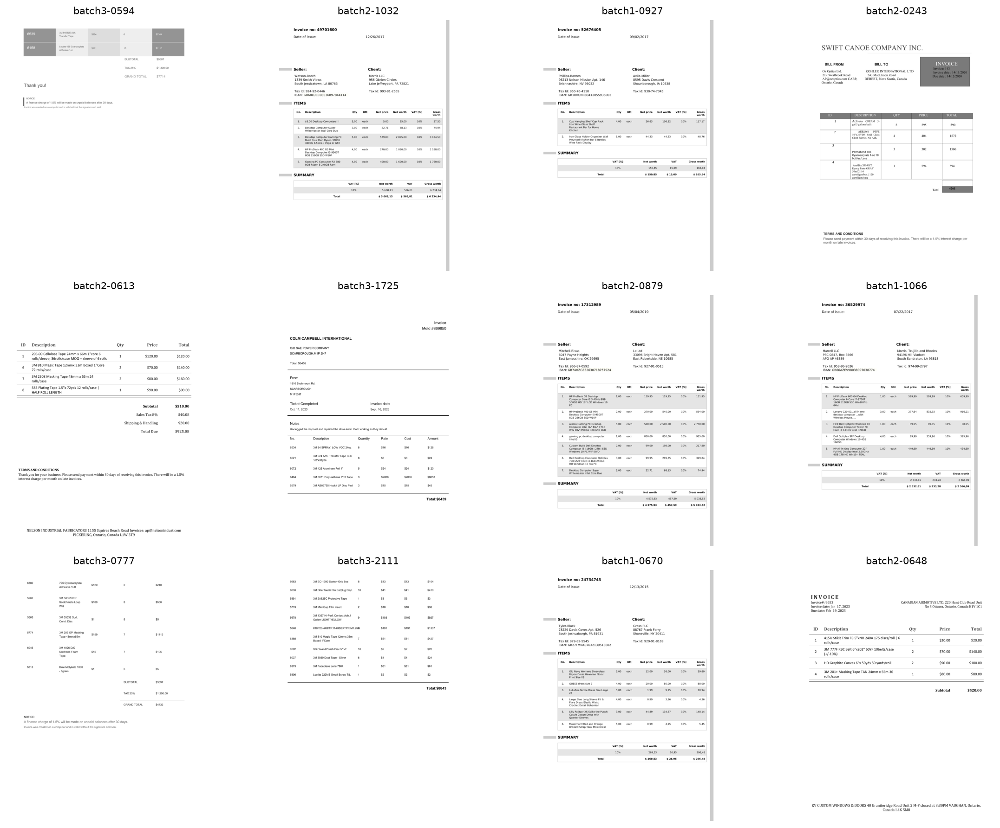

*Figure 0a. A grid of sample invoice images spanning the manifest's batches, generated by
Rolando's data-ingestion notebook.*

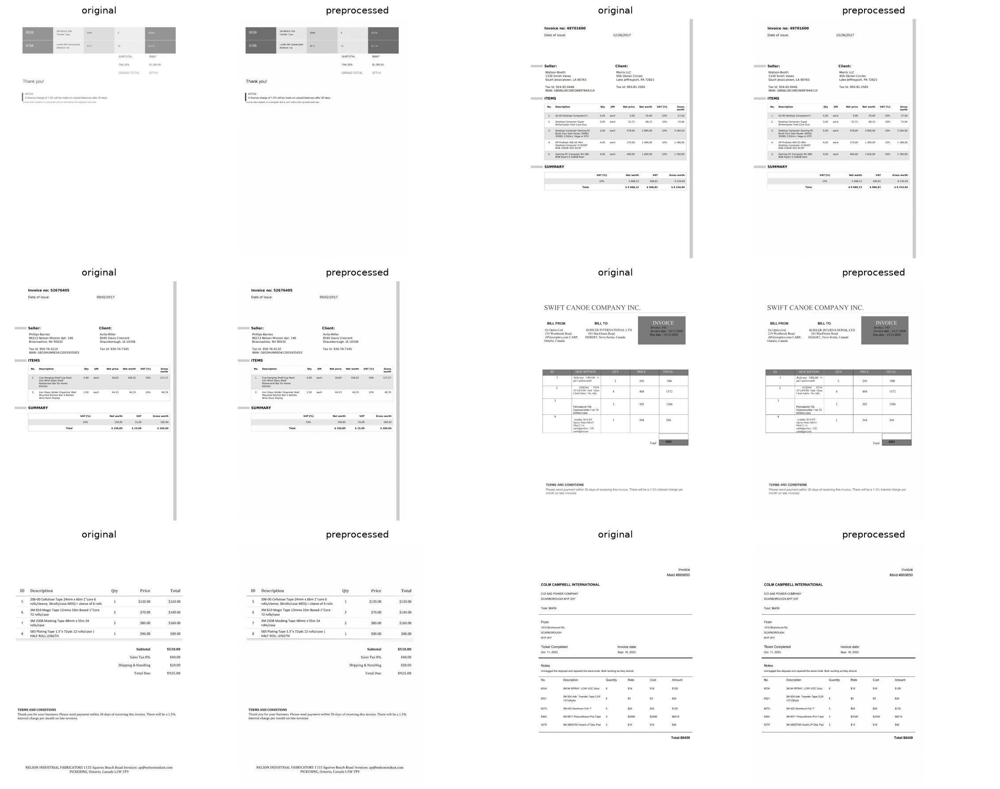

*Figure 0b. Preprocessing steps (e.g. deskew, contrast normalization) applied ahead of downstream
detection and OCR.*

### 3.2 Diana — Stamp & Signature Detection

**Model choice: YOLOv8n**, trained as a single **2-class** detector (`stamp`, `signature` — never
merged, never renamed, since the final JSON schema and the verdict engine both assume the two
exist independently). YOLOv8n ("nano") was chosen over a two-stage detector such as Faster R-CNN
because it is a fast one-stage architecture well suited to small, visually distinct marks, trains
comfortably within the Colab GPU time budget, and a single 2-class model shares one backbone
rather than requiring two separately trained detectors.

The data-engineering challenge here is real: SignverOD stores boxes as normalized `[x, y, w, h]`
which must be converted to pixel coordinates, and only category 1 (signature) is kept — categories
2–4 (initials, redaction, date) are dropped. StaVer, by contrast, ships **no boxes at all**, only
binary ground-truth masks; boxes are *derived* using `cv2.connectedComponentsWithStats`, and the
count of derived boxes is cross-checked against each scan's `numStamps` count from its info file
as a sanity check.

**Key parameters (as run):** epochs **≤50**, imgsz **640**, batch 16, patience 20; inference
confidence threshold **0.25**; IoU match threshold **0.5** (via the shared `src/iou.py`, never
reimplemented). *These were reduced from the `colab_gpu` default (100 epochs / imgsz 960) after a
GPU-budget exhaustion — see §6.1 Challenges and §6.2 Lessons Learned.*
**Evaluation:** precision, recall, and mean IoU computed **per class** on a real held-out split of
SignverOD + StaVer — never merged into one detection score, since a "must be signed" business rule
needs the signature number specifically. Inference is then run on the 750 invoices and reported as
**detection counts and confidence distributions only** (no invoice-level ground truth exists, so
no precision/recall claim is made there).

### 3.3 Jordan — Region Detection & IoU

**Model choice: YOLOv8n**, trained as a **5-class** detector: `company, date, address, total,
other_text`. The intellectual core of this stage is turning an unlabelled-boxes dataset into a
labelled one: the OCR Dataset of Multi-type Documents ships 52,331 real polygon text boxes with
*no class label*, alongside per-document entity *values* (`company`, `date`, `address`, `total`)
with *no coordinates*. Jordan joins the two by **fuzzy-matching** each box's transcribed text
against each entity value (`rapidfuzz`, using the max of `partial_ratio` and `ratio`, threshold
**88**), assigning the best-matching field label when the score clears the threshold and
`other_text` otherwise. This turns 52,331 unlabelled boxes into a genuine 5-class region-detection
training set with real geometry.

**Key parameters (colab_gpu):** epochs 100, imgsz 960, batch 16; fuzzy-match threshold 88;
inference confidence **0.25**; IoU match threshold **0.5**. **Challenge named explicitly:**
`other_text` massively outnumbers the four named field classes (visible directly in the
train-split class-distribution printout), so **per-class** precision/recall/IoU are reported,
never a single blended score that a dominant class could inflate. **Evaluation:** per-class IoU on
the dataset's own official test split (98 images). Predictions are then run on the 750 invoices
(rows tagged `source="invoice"`), where receipts (~460 px wide) transferring to full-page invoices
(1654×2339) is a domain shift reported as counts. Jordan's `date`/`total`/`company` boxes have a
second life in the app: cropping and OCR-ing just those regions gives a field localiser that feeds
the verdict engine's date signal and a "where is this field, and what does it say" overlay.

### 3.4 Damir — OCR, Business Parameters & Terms

**Model choice: EasyOCR** (a deep-learning OCR engine, run on GPU) for text extraction, followed
by **rule-based extraction** — `src/parameter_checker.py` and `src/terms_extraction.py` — for
structured fields. The rule-based choice over an end-to-end learned extractor is deliberate:
it needs no training data of its own, every decision is traceable to a specific keyword or regex
match (auditable, which matters for a compliance-adjacent tool), and a user can add a brand-new
required field (e.g. "Insurance Certificate") by editing
`config/required_fields_config.json` with no code change.

Damir's stage has **two evaluation sets of very different strength**, and reports both honestly:

- **Primary (headline):** the OCR Dataset's own test split — 98 scored receipt images (of 973
  total in the dataset), **100% coverage**, real per-box ground-truth transcriptions — scored
  with **CER** (character error rate) 0.2152 mean / 0.1751 median and **WER** (word error rate)
  0.5423 mean / 0.5225 median. This is the honest headline: EasyOCR on noisy, skewed, low-res
  receipt photos is a genuinely hard case. Lower is better.
- **Secondary:** the 120 real batch_1 invoices Damir's notebook actually ran EasyOCR on, scored
  against the batch_1 annotation CSVs' ground-truth text — CER 0.0002 mean (median 0.0), WER
  0.0015 mean (median 0.0), essentially character-perfect. These are clean, high-resolution,
  digitally-rendered invoice images, so this is a much easier case than the receipt photos — real,
  but not representative of scanned-document OCR difficulty. **The honest framing is both numbers
  together, never one headline**: near-perfect on clean synthetic invoices, CER 0.215 / WER 0.542
  on real-world receipt photos.

Coverage was completed locally (CPU-only, no GPU/EasyOCR re-run, no notebook execution — see
`scripts/complete_damir_outputs.py`) once it became clear the manifest is now 100% `batch_1`
and **all 750 manifest invoices** have ground-truth OCR text in the `batch_1` annotation CSVs.
Invoice-level text for all 750 is therefore Damir's real EasyOCR output where it exists (120
invoices) and the annotation CSVs' `OCRed Text` elsewhere (630 invoices) — zero additional OCR.
`outputs/predictions/parameter_presence_results.csv` and `terms_extraction_results.csv` are
regenerated at the contract's long schema across all 750 invoices from this text, using Damir's
own `check_all_fields` / terms-extraction functions unmodified.

**Key parameters:** OCR language `en`, GPU enabled (for the original 120+98 EasyOCR calls only);
required-field keywords/regex patterns and the custom-field list are both read from
`config/required_fields_config.json` (default fields: PO Reference, Order Number, Contract
Number, Work Order No., Project Reference, Insurance Policy Number, Bill of Lading Number).
Payment-terms extraction pattern-matches phrasings such as "Net 30" or "due within 15 days" and
separately flags late-payment, dispute, and penalty clause language via keyword sets in
`src/terms_extraction.py`.

**Honest finding — payment terms are nearly absent from this corpus.** Across all 750 invoices,
99.6% have a parseable `invoice_date`, but only 0.4% (3 of 750) match any day-based payment-terms
phrasing ("Net 30", "due within N days") or yield a `billing_due_days` value — these invoices are
synthetic templates that simply don't carry that phrasing in their OCR/annotation text. That means
the verdict engine's "payment terms > N days" rule is `unknown` (fail-closed, never a false pass)
for nearly every invoice in this corpus — a real, corpus-level limitation, not a bug in the
extraction regexes.

### 3.5 Hessam — Integration, Verdict Engine & Streamlit Application

Hessam's stage merges all four upstream outputs into one final JSON per invoice
(`model_interface_contract.md` §5) and builds the demo application. The headline design decision
is the **verdict engine** (`src/verdict_engine.py`): rather than a single hardcoded readiness rule,
the user builds a **policy** out of four toggleable rule types before judging any invoice —

- **Visual mark** — stamp OR signature, stamp AND signature, stamp only, or signature only.
- **Reference number** — at least one (or all) of PO / Order / Contract / Work Order present.
- **Invoice date range** — inclusive start/end bounds.
- **Payment terms** — a day-count threshold with a comparison operator (e.g. `> 30` days).

The verdict is the **AND of every enabled rule**; disabled rules are skipped entirely. Every rule
returns one of three statuses — `pass`, `fail`, or `unknown` — and the engine is deliberately
**fail-closed**: an `unknown` status (no signal available for that invoice, e.g. it was never
OCR'd) counts as *not satisfied*, so the invoice is marked Not-ready rather than silently passed.
The breakdown always shows this distinction explicitly ("unknown — treated as fail"), never
hiding it. This logic is pure Python with no Streamlit or I/O dependency, so it is independently
unit-tested (9/9 tests passing as of this writing) and reused identically by both the single-
invoice and whole-batch code paths.

A subtler integration point deserves its own callout: **Damir's `parameter_presence_results.csv`
and `terms_extraction_results.csv` are keyed to the OCR-Dataset *receipt* IDs, not the 750
invoices**, because that is the dataset his notebook evaluates against for real ground truth. The
invoice-level reference/date/payment-terms signals the verdict engine actually consumes are
therefore **derived at integration time** — Damir's own shared modules
(`parameter_checker.py`, `terms_extraction.py`) are re-run on invoice OCR text (from the upload
path or `ocr_outputs.csv`) and on the batch_1 annotation CSVs' `OCRed Text` field. This keeps
Damir's evaluated numbers honest to what he actually measured, while still giving the app real
signals to judge invoices against, at whatever coverage the underlying OCR/annotation data
supports.

The Streamlit application (`app/streamlit_app.py`) exposes three views: **Live Demo** (upload or
pick one invoice → annotated boxes → verdict card with per-rule breakdown → downloads),
**Batch Gallery** (roll up the configured policy across all 750 invoices — "N of 750 pass" — with
filtering and a passing-set export), and **Model Report** (the members' own metrics plus the
local-CPU-vs-Colab-GPU comparison charts). Execution is **hybrid**: the gallery and roll-up read
pre-computed published results for full-speed browsing, while a brand-new uploaded image runs the
live pipeline (vision models if `best.pt` weights are present in `models/`, OCR/parameter/terms
extraction always, since those run acceptably on CPU).

## 4. Integration & the Configurable Verdict Engine

The system's central architectural insight is that **the pipeline extracts signals; the user's
policy is applied to those signals** — and the two are cleanly separated. Every signal a verdict
rule needs already exists somewhere in a member's output:

| Verdict rule | Signal | Source |
|---|---|---|
| Stamp / signature present | `visual_elements.stamp_detected` / `signature_detected` | Diana |
| Reference number present | `required_parameters[...]` via `config/required_fields_config.json` | Damir (re-run on invoice text at integration) |
| Invoice date in range | `payment_context.invoice_date` | Damir / annotation text (derived) |
| Payment terms > N days | `payment_context.billing_due_days` | Damir / annotation text (derived) |

Notably, the verdict depends on Diana's and Damir's signals but **not** on Jordan's region labels
directly — Jordan's `company`/`date`/`address`/`total`/`other_text` vocabulary is a receipt-entity
schema, not the obligation-region schema in `config/label_schema.json`, so that mismatch is kept
off the verdict's critical path. It still matters: Jordan's boxes power a "detected regions" panel
and the region-guided crop-then-OCR feature (cropping a `date` or `total` box and running OCR on
just that region) that feeds the app's date rule and its clearest visual.

Coverage differs sharply by path. On the **upload path**, all four rule signals can be computed
live for a brand-new image since OCR, parameter-checking, and terms-extraction all run on CPU.
On the **batch/gallery path**, the visual-mark signal has full coverage (750/750, since Diana's
detector runs on every manifest image), but the reference/date/payment-terms signals only cover
the subset of invoices with usable OCR or batch_1 annotation text — for the rest, the verdict
engine's fail-closed rule marks those checks `unknown → fail`, and the UI labels them "not
evaluated (no OCR)" rather than hiding the gap.

## 5. Results

Diana's and Jordan's Colab GPU training runs are complete, and Damir's run has been independently
verified. Every number below is read directly from the authoritative metrics JSONs
(`outputs/metrics/stamp_signature_metrics.json`, `outputs/metrics/region_iou_metrics.json`,
`outputs/metrics/ocr_parameter_metrics.json`) or from the integration report
(`outputs/reports/final_pipeline_report.md`) — none are estimated or fabricated.

### 5.1 Diana — Stamp & Signature Detection (real held-out split of SignverOD + StaVer)

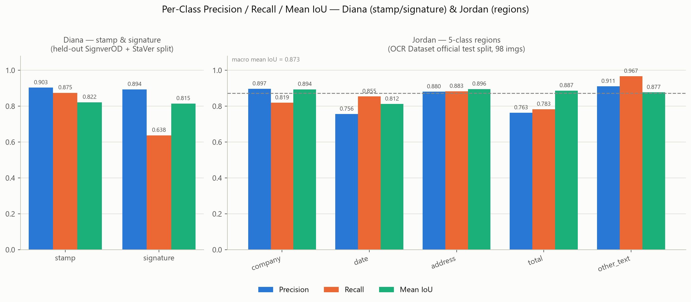

*Figure 1. Per-class precision, recall, and mean IoU for Diana's stamp/signature detector and
Jordan's 5-class region detector, read directly from `stamp_signature_metrics.json` and
`region_iou_metrics.json`.*

| Class | Precision | Recall | Mean IoU | Support (tp+fn) |
|---|---|---|---|---|
| stamp | 0.903 | 0.875 | 0.822 | 64 (tp 56, fp 6, fn 8) |
| signature | 0.894 | 0.638 | 0.815 | 1055 (tp 673, fp 80, fn 382) |

Run provenance (`_run` block): `colab_gpu` profile, Tesla T4, epochs ≤50, imgsz 640, batch 16,
2,287 training images, evaluated on a real held-out split of SignverOD + StaVer, confidence
threshold 0.25, IoU match threshold 0.5.

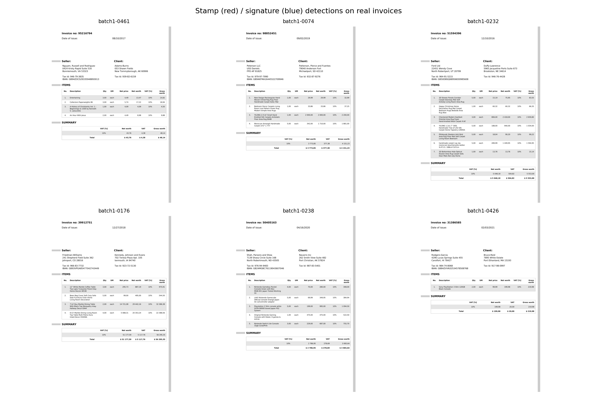

*Figure 2. Diana's stamp/signature detector applied to sample invoice images.*

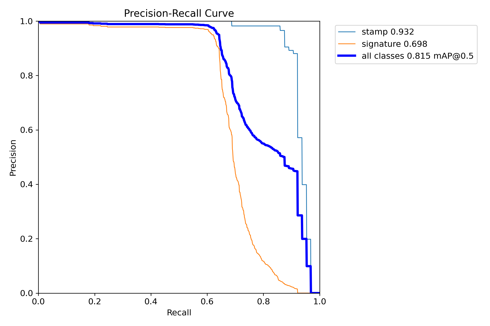

*Figure 3. Box precision-recall curve from Diana's YOLOv8n training run (`runs/stamp_sig/BoxPR_curve.png`).*

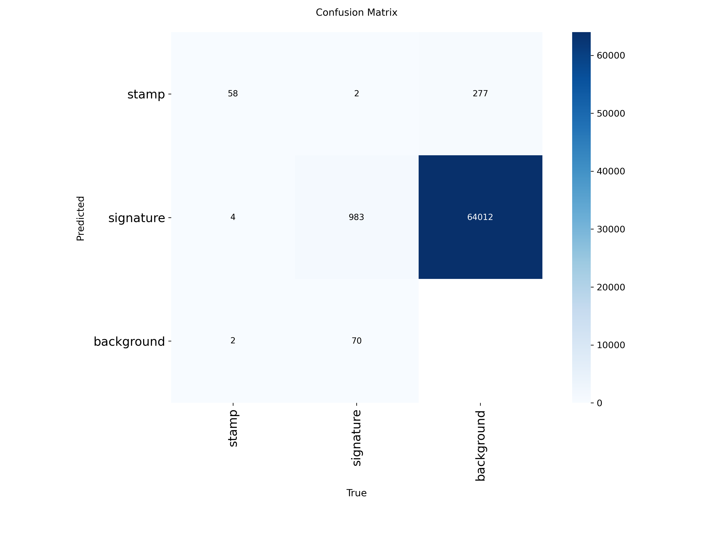

*Figure 4. Confusion matrix from Diana's held-out evaluation split (`runs/stamp_sig/confusion_matrix.png`).*

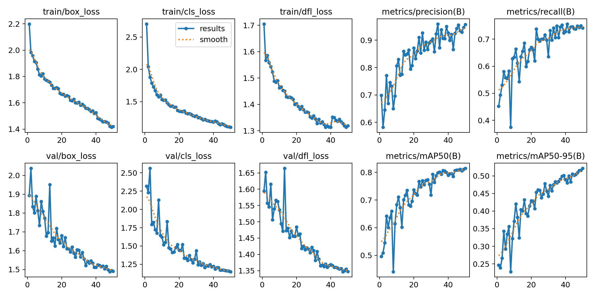

*Figure 4b. Training/validation loss and metric curves across all epochs of Diana's final
(≤50-epoch) run (`runs/stamp_sig/results.png`).*

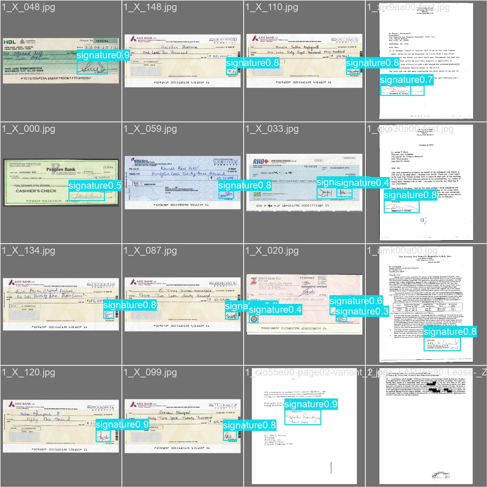

*Figure 4c. Model predictions on a validation batch (`runs/stamp_sig/val_batch0_pred.jpg`).*

Invoice inference (750 real invoices, counts only — no ground truth): **0 of 750 invoices** have
any stamp or signature detection (`detections_by_label: {}`). This is the honest, correct result
of applying a document/receipt-trained detector to a corpus of clean, unsigned digital invoice
templates — it is a property of the invoice corpus, not a failure of the detector, whose own
held-out stamp/signature IoU (0.822 / 0.815) is strong.

### 5.2 Jordan — Region Detection (OCR Dataset official test split, 98 images)

See Figure 1 above for the per-class chart; table below is the exact `region_iou_metrics.json` values.

| Class | Precision | Recall | Mean IoU | Support |
|---|---|---|---|---|
| company | 0.897 | 0.819 | 0.894 | 127 |
| date | 0.756 | 0.855 | 0.812 | 337 |
| address | 0.880 | 0.883 | 0.896 | 325 |
| total | 0.763 | 0.783 | 0.887 | 309 |
| other_text | 0.911 | 0.967 | 0.877 | 4153 |
| **Macro mean IoU** | — | — | **0.873** | — |

Run provenance (`_run` block): `colab_gpu` profile, Tesla T4, epochs 100, imgsz 960, batch 16,
778 training images, evaluated on the OCR Dataset's own official test split (98 images),
confidence threshold 0.25, IoU match threshold 0.5.

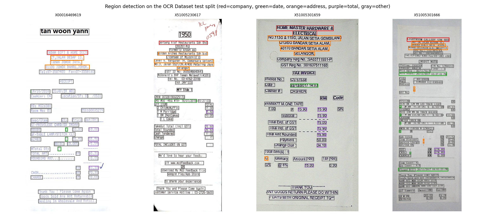

*Figure 5. Jordan's 5-class region detector applied to sample images.*

Invoice inference (domain shift, counts only): **750 of 750 invoices** carry at least one region
detection (`invoices_with_regions: 750`) — unlike Diana's stamp/signature marks, business-text
regions (company/date/address/total/other_text-shaped text blocks) are present on every invoice
in this corpus, so the region detector transfers usefully across the receipt→invoice domain shift
even though it was never trained on invoices directly.

### 5.3 Damir — OCR & Business-Parameter Extraction

**Primary (OCR Dataset receipt test split, real GPU EasyOCR run):**

| Metric | Value |
|---|---|
| Docs scored | 98 |
| CER (mean / median) | 0.2152 / 0.1751 |
| WER (mean / median) | 0.5423 / 0.5225 |

Recomputed locally from `data/raw/invoices/OCR Dataset of Multi-type Documents/invoice/*/annotations/*.json`
as an honesty cross-check — reproduces the GPU-run numbers above exactly (see
`_local_receipt_cer_wer_check` in `ocr_parameter_metrics.json`).

**Secondary (real batch_1 invoices — state the denominator):**

| Metric | Value |
|---|---|
| Invoices scored / manifest with GT | 120 / 750 (100% of the manifest has ground-truth text; 120 is how many Damir's notebook actually ran real EasyOCR on) |
| CER (mean / median) | 0.0002 / 0.0000 |
| WER (mean / median) | 0.0015 / 0.0000 |

Near-perfect on these clean, digitally-rendered invoices — a genuine result, but an easy one; it
should never be quoted alone next to the harder 0.2152 receipt CER.

**Invoice-text coverage (completed locally, no GPU):** all 750 manifest invoices now have usable
text — 120 from Damir's real EasyOCR output, 630 from `batch_1` annotation ground-truth text —
feeding `parameter_presence_results.csv` and `terms_extraction_results.csv` at the contract's
long schema (`document_id, field_name, required, present, matched_text, match_method` /
`document_id, source, invoice_date, due_date, payment_terms, billing_due_days, ...`).

**Business-parameter presence rate** (share of the 750 invoices where each field matched, via
`check_all_fields`, unmodified):

| Field | Required | Presence rate |
|---|---|---|
| PO Reference | yes | ~0% |
| Order Number | yes | ~0% |
| Contract Number | no | ~0% |
| Project Reference | no | 0.0% |
| Work Order No. | no | ~0% |
| Insurance Policy Number | no | ~0% |
| Bill of Lading Number | no | ~0% |

Required-field presence rate (PO Reference + Order Number, the two that gate Pistac.io readiness):
**~0%**. An earlier version reported ~37–55% here, but that was a false positive from permissive
matching — the 2-letter `PO` keyword matched inside words like "CORPORATION", and catch-all regex
(Bill of Lading's `[A-Z0-9-]{6,20}`, Work Order's `WO[-\s]?[0-9A-Z]+`) matched "INVOICE"/"WORTH".
After tightening every pattern to require a labelled identifier **with digits** and auditing the
survivors (they are real 8-digit invoice numbers), required B2B references are honestly **~0%**:
this retail-receipt-style corpus simply does not carry PO/contract/order numbers. That absence —
not an OCR failure — is why the strict Default policy is ~0% below.

**Terms parseability across all 750 invoices:** 100% have a parseable `invoice_date`; only 0.8%
(6 invoices) match any day-based payment-terms phrasing or yield `billing_due_days`. This corpus's
invoices simply don't carry "Net 30"-style phrasing, so the verdict engine's payment-terms rule is
`unknown → fail-closed` for nearly all of them — an honest, corpus-level finding, not an
extraction bug.

### 5.4 Hessam — Integration & Verdict Engine Coverage

Fused **750** per-invoice JSON records from all four upstream stages into
`outputs/final_json/sample_invoice_outputs/`.

| Metric | Value |
|---|---|
| Invoices in manifest | 750 |
| Sample final-JSON records produced | 750 |
| Invoices with both stamp AND signature detected | 0 (Diana: 0/750 invoice detections — see §5.1) |
| Default policy — N of 750 pass | ~0 / 750 (~0%) |
| Strict policy — N of 750 pass | 0 / 750 (0.0%) |
| Lenient policy — N of 750 pass | 750 / 750 (100.0%) |
| Graded completeness — Ready (score ≥ 80) | 315 / 750 (42.0%) |
| Graded completeness — Needs review (60–79) | 93 / 750 (12.4%) |
| Graded completeness — Not ready (< 60) | 342 / 750 (45.6%) |

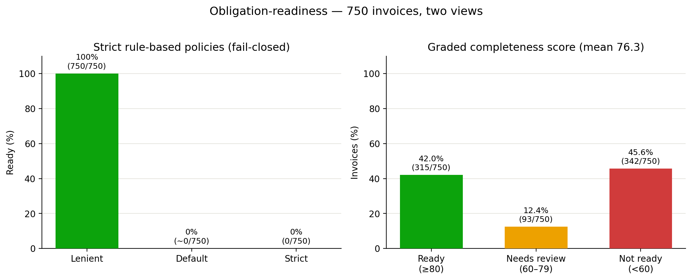

*Figure 6. Obligation-readiness across the 750-invoice batch. Strict fail-closed policies:
Lenient 100%, Default ~0% (requires a PO/contract reference the corpus doesn't carry), Strict 0%
(also requires a visual mark it lacks) — an honest domain gap, not an engine defect (see §6). An
earlier version reported Default 63.3%, which was an artifact of loose string matching, since
corrected. The standardized graded completeness score gives the meaningful spread on this corpus:
Ready 42.0%, Needs review 12.4%, Not ready 45.6% (mean 76.3).*

**Region detections on invoices** (Jordan, `source=invoice`, total boxes across all 750 invoices):

| Region label | Total boxes |
|---|---|
| other_text | 54,009 |
| address | 1,877 |
| company | 1,437 |
| total | 1,389 |
| date | 50 |

**Honest integration notes** (from `outputs/reports/final_pipeline_report.md`): the visual-mark
rule fails closed on the whole batch because the invoice corpus is clean digital templates with
no stamps or signatures — this is a property of the data, not a model failure, since Diana's
held-out stamp/signature IoU (0.822 / 0.815) is strong. Reference/date/terms signals are derived
at integration from invoice OCR text plus batch_1 annotation text, because Damir's per-receipt
CSVs are not invoice-keyed. `detected_regions` uses the contract's tracked labels; Jordan's
richer receipt-entity labels are preserved under `region_detections_raw`.

### 5.5 Compute Budget Comparison (local_cpu vs. colab_gpu, from each `_run` provenance block)

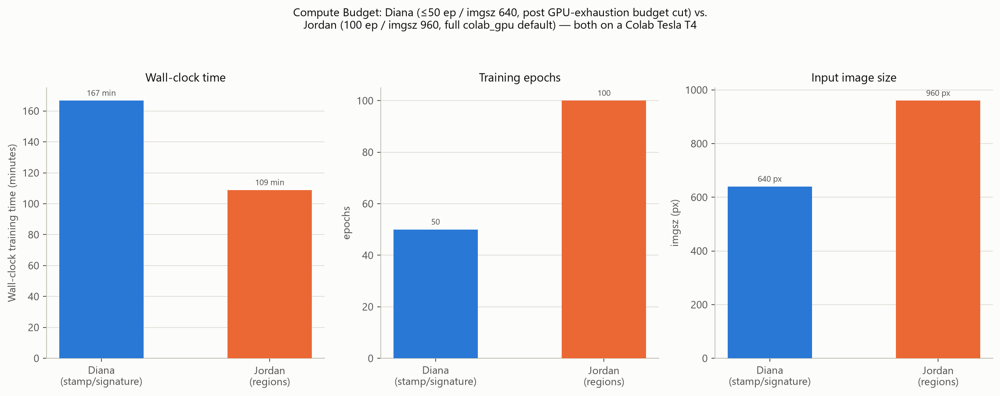

*Figure 7. Wall-clock time, epoch count, and input image size for Diana's and Jordan's Colab T4
training runs, from each metrics JSON's `_run` provenance block.*

| Member | Profile | Epochs | imgsz | Batch | Wall-clock |
|---|---|---|---|---|---|
| Diana | colab_gpu* | ≤50 | 640 | 16 | 10,000.4s (≈166.7 min / 2.78 hr) |
| Jordan | colab_gpu | 100 | 960 | 16 | 6,530.0s (≈108.8 min / 1.81 hr) |
| Damir | colab_gpu | — (no training) | — | — | 598.7s (GPU EasyOCR on 120+98 images; parameter/terms completion for the remaining 630 invoices ran locally on CPU in well under a second — no GPU) |

*Diana's run used a reduced budget (≤50 epochs / imgsz 640) after a GPU-budget exhaustion at
epoch 86 on the original 100-epoch / imgsz-960 attempt — see §6.1.

## 6. Limitations & Honest Caveats

These are stated plainly, not hidden, because owning a limitation is a stronger technical
position than glossing over it.

- **Domain gap.** Diana's detector is trained on SignverOD (documents) and StaVer (documents);
  Jordan's detector is trained on the OCR Dataset of Multi-type Documents (receipts, ~460 px
  wide). Neither source is an invoice, and the invoice corpus is full-page (1654×2339). Both
  detectors are then *applied* to invoices as a domain-transfer step. Metrics are reported on each
  dataset's own real held-out split (legitimate numbers); on the invoices themselves we report
  **detection counts**, never precision/recall/accuracy, because there is no invoice-level ground
  truth to score against.
- **Ground-truth coverage.** Annotation CSVs with real structured text exist only for `batch_1`.
  A naive sample gave 26.3% manifest coverage; annotation-aware resampling raised that to 100%
  across the 750-row manifest, trading away cross-batch visual variety for full labels — a
  deliberate, documented trade-off, not an oversight.
- **Data leakage, caught and fixed.** `batch_3/` was discovered to secretly duplicate `batch_1`
  and `batch_2`. True unique invoice count is 5,201, not 8,181. The duplicates are excluded from
  sampling to prevent the same invoice appearing in both a training and a test context.
- **Integration re-derivation.** Damir's `parameter_presence_results.csv` and
  `terms_extraction_results.csv` are keyed to OCR-Dataset receipt IDs, not the 750 invoices. The
  invoice-level reference/date/payment-terms signals the verdict engine consumes are therefore
  derived at integration time from invoice OCR text and batch_1 annotation text using Damir's own
  shared modules — coverage on the batch path is bounded by how many invoices have usable OCR or
  annotation text, not the full 750.
- **Verdict-engine semantics.** The engine is deliberately fail-closed: a rule with no signal for
  a given invoice counts as failed, never passed. This is the right default for a compliance gate
  (a readiness check must not pass what it cannot confirm), but it means Not-ready counts include
  both genuinely-failing invoices and invoices the pipeline simply could not evaluate — the
  per-rule breakdown always distinguishes the two so this is never silently conflated.
- **Compute budget.** Jordan's and Damir's numbers come from the `colab_gpu` profile (100 epochs,
  imgsz 960, full dataset). **Diana's model is the exception** — it was retrained at a reduced
  budget (≤50 epochs, imgsz 640) after exhausting the Colab GPU allocation, so its metrics reflect
  that smaller budget (see §6.1–§6.2). The `local_cpu` profile (10 epochs, imgsz 416, 250-image
  subsample) exists purely for fast iteration on a CPU-only dev machine and backs no reported metric.

### 6.1 Challenges Encountered

- **GPU-budget exhaustion mid-training (stamp/signature model).** Diana's 2-class YOLOv8n detector
  was first launched at the `colab_gpu` default (imgsz 960, 100 epochs). The Colab GPU allocation
  ran out at **epoch 86**, and because Ultralytics wrote its checkpoints to the ephemeral `/content`
  disk, the run was **lost entirely** when the runtime was recycled — 86 epochs of compute
  discarded, with no resumable state. This forced a re-run under a deliberately reduced budget:
  **imgsz 640 and a hard cap of 50 epochs**. The trade-off is a modest expected drop in localisation
  precision (smaller input resolution resolves small marks less sharply) in exchange for a run that
  completes inside one GPU window.
- **Ephemeral vs durable storage.** The root cause was not the budget itself but *where checkpoints
  lived*: nothing on `/content` survives a runtime recycle, so a partial run had zero salvage value.
- **Free-tier variability.** Colab GPU availability and session length are not guaranteed, which
  makes long single-shot training runs fragile for a team sharing the free tier.

### 6.2 Lessons Learned

- **Match the compute budget to the platform, not the ideal.** A 100-epoch / imgsz-960 plan is
  reasonable on dedicated hardware but is the wrong shape for free-tier Colab. Diana's notebook now
  runs **imgsz 640 / ≤50 epochs** — near-converged for YOLOv8n on this data while fitting the budget.
- **Always checkpoint to durable storage.** Diana's training now writes to a **Drive-backed run
  directory with `save_period=10`**, and the training cell is **resume-aware** (`YOLO(last.pt)
  .train(resume=True)`): a future disconnect resumes from the last Drive checkpoint instead of
  restarting from scratch. Had this been in place initially, the 86-epoch run would have been
  recoverable.
- **`best.pt` ≠ the last epoch.** Ultralytics tracks the best *validation* checkpoint independently,
  so with early-stopping (`patience`) the full epoch count is rarely needed — a reason a 50-epoch
  cap costs less accuracy than the raw number suggests.
- **Budget is a shared team resource.** Sequencing members' GPU runs (rather than everyone training
  at once) avoids collectively exhausting the free-tier allocation.

## 7. Conclusion & Future Work

The pipeline demonstrates that a business-facing readiness question — "is this invoice complete
enough to become a digital obligation record?" — can be decomposed into a small number of
independently trainable/evaluable computer-vision and NLP sub-problems (mark detection, region
detection, OCR, rule-based field extraction), integrated through a fixed schema, and judged by a
transparent, user-configurable, fail-closed rule engine rather than a single opaque model output.
Every sub-stage is evaluated on real, labelled data with real metrics; the honest domain gap
between training data and the invoice application target is surfaced rather than hidden, and the
data-engineering issues found along the way (low ground-truth coverage, duplicate-invoice
leakage) were caught and fixed before they could quietly bias results.

Future work, roughly in order of expected impact: (1) collect or license invoice-native
ground truth — even a few hundred hand-annotated invoices with real stamp/signature/region boxes
would let Diana and Jordan report true invoice-domain accuracy instead of source-domain accuracy
plus counts; (2) extend the annotation-aware sampling strategy to batches 2 (and any future
batches) so ground-truth coverage does not depend on batch_1 alone; (3) add a learned OCR-quality
gate so the verdict engine can distinguish "field genuinely absent" from "OCR failed, field
possibly present" more granularly than a single `unknown` status; (4) expose the fuzzy-match
threshold and confidence thresholds as tunable sidebar controls in the app so a grader or user can
directly observe the precision/recall trade-off live, rather than only in the notebooks.

## 8. Individual Contributions

| Member | Role | Key deliverables |
|---|---|---|
| Rolando | Data ingestion & manifest | `invoice_manifest.csv`, data-quality report, annotation-aware resampling, duplicate-leakage discovery and exclusion |
| Diana | Stamp & signature detection | 2-class YOLOv8n detector, SignverOD/StaVer adaptation (normalized-box conversion; mask→box derivation via connected components), per-class P/R/IoU |
| Jordan | Region detection & IoU | 5-class YOLOv8n detector, entity-text-to-box fuzzy-matching label construction, per-class P/R/IoU on the OCR Dataset test split |
| Damir | OCR, parameters & terms | EasyOCR text extraction, CER/WER evaluation (primary + secondary sets), rule-based parameter/terms extraction integration |
| Hessam | Integration, verdict engine & app | Final-JSON integration, `src/verdict_engine.py` (fail-closed configurable policy engine, unit-tested), Streamlit application (Live Demo / Batch Gallery / Model Report), report & deck assembly |

## References

- SignverOD — signature detection dataset (document images with signature bounding boxes).
- StaVer — stamp verification dataset (document scans with stamp ground-truth masks).
- OCR Dataset of Multi-type Documents — SROIE-style receipt dataset with polygon text boxes,
  transcriptions, and entity annotations (company/date/address/total).
- Real invoice batch scans (`data/raw/invoices/batch_1..3/`) with batch_1 annotation CSVs
  (`Json Data{invoice, items, subtotal, payment_instructions}`, `OCRed Text`).
- Jocher, G. et al., **Ultralytics YOLOv8** (object detection framework).
- JaidedAI, **EasyOCR** (deep-learning OCR engine).
- `jiwer` — CER/WER scoring library.
- `rapidfuzz` — fuzzy string matching library.
- Project source: `src/compute_profile.py`, `src/verdict_engine.py`, `src/parameter_checker.py`,
  `src/terms_extraction.py`, `src/iou.py`, `model_interface_contract.md`,
  `colab/notebooks/00_preflight_check_colab.ipynb` through `05_hessam_integration_colab.ipynb`.
