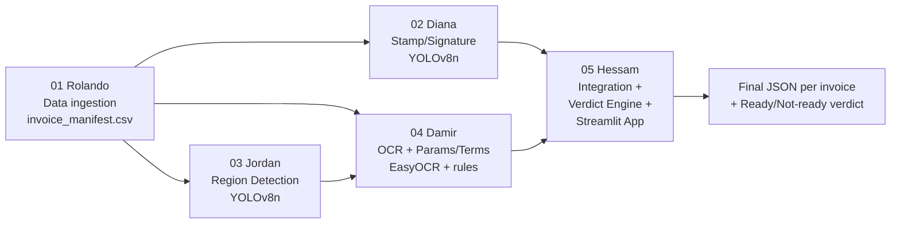

# Invoice Region Detection & Business-Parameter Extraction
## From Scanned Invoice to Obligation-Readiness Verdict

**Rolando · Diana · Jordan · Damir · Hessam**
Deep Learning II — Group Project

<!-- speaker notes:
Welcome everyone. Today we're presenting an end-to-end pipeline that takes a scanned invoice
image and decides whether it's ready to become a structured digital obligation record — with
a transparent, user-configurable verdict, not a black box. Five of us, five stages, one shared
interface contract. -->

---

# The Business Problem

- A business receives **thousands of invoices as images/scans**
- Before an invoice can feed an automated finance workflow, someone must check:
  - Is it **signed or stamped**?
  - Does it cite a **PO / contract / work order**?
  - Does it state clear **payment terms** and a valid **date**?
- Manual triage doesn't scale — slow, inconsistent, delays payment
- **Goal:** read an invoice image → structured JSON + a transparent **Ready / Not-ready** verdict

<!-- speaker notes:
This is the Pistac.io framing: a digital obligation record is a machine-readable summary of what
an invoice obligates the business to do, and by when, that downstream systems can act on without
a human reading the source image first. At real volume, manual review is the bottleneck we're
targeting. -->

---

# Why This Is a Vision + OCR Problem

- Not just "read the text" — first you must know **where to look**
- Detect visual marks (stamp/signature) and business regions **before** running OCR
- OCR only the relevant crops → faster, more accurate than OCR-everything
- Then apply **rule-based extraction** to the OCR'd text for structured fields
- Finally, judge the extracted signals against a **user-defined policy**

<!-- speaker notes:
We split the problem into detection (where), reading (what), and judgment (is it enough).
That separation is what let five people work in parallel on independent, testable stages. -->

---

# Pipeline Overview

<!-- speaker notes:
Each notebook publishes its outputs to Google Drive; Hessam's integration stage consumes all
four upstream outputs and produces one JSON per invoice plus the verdict. document_id is the
join key across every CSV. -->

---

# Datasets — and an Honest Domain Gap

| Dataset | Contents | Used by |
|---|---|---|
| Invoice batches | ~5,201 unique real scans; 750 sampled; batch_1 has real annotations | Rolando, all |
| OCR Dataset of Multi-type Documents | 973 receipts, 100% annotated, 52,331 real boxes | Jordan, Damir |
| SignverOD | 2,765 document images, signature boxes | Diana |
| StaVer | 400 scans, stamp ground-truth **masks** | Diana |

- **None of these are invoices.** Detectors train on the best real labelled data, then get
  **applied** to invoices
- On invoices: we report **detection counts**, not accuracy — there's no invoice-level ground truth

<!-- speaker notes:
Say this part out loud — it's a strength, not a weakness, to be upfront about it. Our metrics
are real numbers on each dataset's own held-out split. Applying to invoices is an honest,
disclosed domain-transfer step. -->

---

# Rolando — Data Ingestion & the Manifest

- **No model** — this is data engineering, and the whole pipeline's honesty starts here
- Builds `invoice_manifest.csv`: `document_id, image_path, width, height, split, has_ground_truth`
- **Annotation-aware resampling:** naive sampling → 26.3% GT coverage → resampled to **100%**
  (750 rows, split 525/120/105)
- **Caught real data leakage:** `batch_3/` secretly duplicates batches 1–2
  → true unique count = **5,201, not 8,181** → duplicates excluded

<!-- speaker notes:
Garbage in, garbage out. If the manifest is wrong, every downstream metric is wrong. The
annotation-aware resampling was a real trade-off: full labels vs. cross-batch visual variety.
Catching the batch_3 duplication before it leaked into train/test splits was one of the more
important engineering wins in this project. -->

---

# Diana — Stamp & Signature Detection

- **Model: YOLOv8n**, single **2-class** detector (`stamp`, `signature` — never merged)
- One-stage detector: fast, good for small/distinct marks, fits the Colab time budget
- **SignverOD:** normalized boxes → pixels; only category 1 (signature) kept
- **StaVer:** ships **no boxes**, only masks → boxes **derived** via
  `cv2.connectedComponentsWithStats`, cross-checked against `numStamps`

<!-- speaker notes:
Why one 2-class model instead of two separate detectors? Simpler, shares a backbone, still
reports fully separate per-class metrics. The mask-to-box derivation for StaVer was the
trickiest engineering piece of this notebook — know it cold for questions. -->

---

# Diana — Parameters & Evaluation

- **As run (budget-optimized):** epochs **≤50**, imgsz **640**, batch 16, patience 20
  - reduced from 100 / 960 after a **GPU-budget exhaustion at epoch 86** (see Challenges)
- Inference confidence threshold **0.25**; IoU match threshold **0.5** (`src/iou.py`)
- **Per-class** precision / recall / mean IoU on a real held-out split
- Inference on 750 invoices → **detection counts only** (no invoice-level GT)

| Class | Precision | Recall | Mean IoU |
|---|---|---|---|
| stamp | ⟪TBD⟫ | ⟪TBD⟫ | ⟪TBD⟫ |
| signature | ⟪TBD⟫ | ⟪TBD⟫ | ⟪TBD⟫ |

<!-- speaker notes:
Report per-class, never a blended score — a "must be signed" business rule cares about the
signature number specifically. Numbers land once the Colab run finishes; full detail in
outputs/metrics/stamp_signature_metrics.json. -->

---

# Jordan — Region Detection: the Clever Bit

- **Model: YOLOv8n**, **5-class** detector: `company, date, address, total, other_text`
- OCR Dataset gives **text boxes with no class** + **entity values with no coordinates**
- **Join by fuzzy-matching** entity text to box text (`rapidfuzz`, threshold **88**)
  → turns 52,331 unlabelled boxes into a real 5-class training set
- This is the intellectual core of the notebook

<!-- speaker notes:
Walk through the matching: for each box, compute partial_ratio and ratio against every entity
value, take the max, assign the field if it clears 88, else other_text. Explain what it can
mislabel — near-duplicate text, partial substrings. -->

---

# Jordan — Class Imbalance & Evaluation

- **Challenge:** `other_text` massively outnumbers the four field classes
  → report **per-class** precision/recall/IoU, never a single mAP
- **colab_gpu:** epochs 100, imgsz 960, batch 16; conf 0.25, IoU threshold 0.5
- Evaluated on the OCR Dataset's own **test split** (98 images)
- Invoice inference (`source="invoice"`): receipts → full-page invoices is a domain shift → counts only

| Class | Precision | Recall | Mean IoU |
|---|---|---|---|
| company / date / address / total / other_text | ⟪TBD⟫ | ⟪TBD⟫ | ⟪TBD⟫ |
| **Macro mean IoU** | — | — | ⟪TBD⟫ |

<!-- speaker notes:
Jordan's date/total/company boxes get a second life in the app: crop + OCR just that region to
localize and read key fields — this feeds the verdict engine's date rule. -->

---

# Damir — OCR, Parameters & Terms

- **OCR: EasyOCR** (deep-learning, GPU) — vs. Tesseract/PaddleOCR: stronger accuracy, simple setup
- **Rule-based extraction** on top (`src/parameter_checker.py`, `src/terms_extraction.py`)
  — transparent, no training data needed, user-extensible via config, not code
- Reads field definitions from `config/required_fields_config.json`
  (PO Reference, Order Number, Contract Number, Work Order No., …)
- Extracts payment terms ("Net 30"), due dates, and flags late-payment/dispute/penalty clauses

<!-- speaker notes:
Why rule-based instead of an end-to-end learned extractor? No labelled training data required
for these fields, every match is traceable to a keyword or regex (auditable), and a user can add
a new required field from the sidebar with zero code changes. -->

---

# Damir — Two Evaluation Sets, Reported Honestly

**Primary — OCR Dataset test split (100% coverage, real per-box GT text)**

| Metric | Value |
|---|---|
| CER (mean) | ⟪TBD⟫ |
| WER (mean) | ⟪TBD⟫ |

**Secondary — real batch_1 invoices (small, but real full-page invoices)**

- Denominator always stated: only **~197 of 750** manifest images carry any ground truth
- CER (mean): ⟪TBD⟫

<!-- speaker notes:
Always name the denominator when reporting the secondary number — it's honest and it's a
strength to volunteer this, not something a professor has to extract with a follow-up question. -->

---

# Hessam — Integration & the Final JSON

- Merges Diana + Jordan + Damir outputs into **one JSON per invoice**
  (`document_id` is the join key across every CSV)
- Schema fixed by `model_interface_contract.md` — visual elements, detected regions, required
  parameters, payment context, terms & conditions, readiness, model metrics
- **Integration nuance:** Damir's parameter/terms CSVs are keyed to the **receipt dataset**, not
  the 750 invoices → invoice-level signals are **derived at integration** from invoice OCR text +
  batch_1 annotation text, using Damir's own shared modules

<!-- speaker notes:
This is a subtle but important point: we didn't fork Damir's logic, we re-ran his exact shared
functions against a different text source at integration time — so results stay comparable and
auditable back to one implementation. -->

---

# The Verdict Engine — User-Configurable, Fail-Closed

- The user **builds a policy** from four toggleable rule types before judging any invoice:
  - **Visual mark** — stamp OR/AND signature (or either alone)
  - **Reference number** — any-of PO / Order / Contract / Work Order
  - **Invoice date range**
  - **Payment terms** — e.g. `> 30` days
- **Verdict = AND of every enabled rule**
- **Fail-closed:** missing evidence (`unknown`) counts as **fail** — never a silent pass
- Pure logic, no I/O — independently unit-tested (`src/verdict_engine.py`)

<!-- speaker notes:
This is the headline feature. A compliance officer, an AP clerk, and an auditor may reasonably
want different thresholds — so the policy is exposed as configuration, not buried in code. And a
readiness gate must never pass what it cannot confirm — that's why we chose fail-closed as the
default, and we show it transparently in the breakdown rather than hiding the "unknown" case. -->

---

# Live Demo — the Streamlit App

- **Live Demo** — upload or pick one invoice → annotated boxes → verdict card with per-rule
  breakdown → JSON / report download
- **Batch Gallery** — apply the policy across all 750 invoices → **"N of 750 pass"** → filter,
  drill down, export the passing set
- **Model Report** — each member's real metrics + local-CPU-vs-Colab-GPU comparison charts
- Hybrid execution: gallery reads pre-computed results; a new upload runs the live pipeline

<!-- speaker notes:
[SHOW: switch policy presets live — Default / Strict / Lenient — and watch the verdict and the
batch roll-up count change in real time.] This is the moment that makes "configurable" concrete
instead of just a claim. -->

---

# Results

*Diana and Jordan's Colab GPU runs, and independent verification of Damir's run, were still in
progress at report time — every cell below is a placeholder, not a guess.*

| Stage | Headline metric | Value |
|---|---|---|
| Diana (stamp/signature) | Precision / Recall / Mean IoU per class | ⟪TBD⟫ |
| Jordan (regions) | Per-class Mean IoU, macro mean IoU | ⟪TBD⟫ |
| Damir (OCR) | CER / WER (primary, 100% coverage) | ⟪TBD⟫ |
| Hessam (integration) | N of 750 invoices Ready under Default policy | ⟪TBD⟫ |

<!-- speaker notes:
Be upfront: these numbers are structured and ready to receive real values the moment training
finishes — we are not hiding behind "TBD," we're showing exactly what will be reported and why
each metric was chosen. -->

---

# Limitations & Honest Caveats

- **Domain gap:** detectors train on documents/receipts, get *applied* to invoices — counts, not
  accuracy, on invoices
- **GT coverage:** annotation CSVs exist only for batch_1 — resampling lifted coverage 26.3% → 100%,
  trading cross-batch variety for full labels
- **Data leakage caught:** batch_3 duplicated batches 1–2 — true unique invoices = 5,201, not 8,181
- **Integration re-derivation:** Damir's receipt-keyed CSVs → invoice signals derived at
  integration; batch-path coverage is bounded by available OCR/annotation text
- **Fail-closed by design:** "Not-ready" includes both real failures and unconfirmed checks —
  always shown separately in the breakdown

<!-- speaker notes:
Every one of these is stated plainly because owning a limitation is a stronger position than
hiding it — and because it's true. Rehearse being able to explain *why* each trade-off was made,
not just that it exists. -->

---

# Conclusion & Future Work

- A business-facing readiness question decomposes into independently trainable/evaluable stages,
  integrated through a fixed schema, judged by a **transparent, configurable, fail-closed** engine
- Every stage evaluated on real, labelled data with real metrics; domain gap disclosed, not hidden
- **Future work:**
  - Collect invoice-native ground truth for stamp/signature/region boxes
  - Extend annotation-aware sampling beyond batch_1
  - A learned OCR-quality gate to distinguish "absent" from "OCR failed"
  - Expose confidence/fuzzy-match thresholds as live sidebar controls

<!-- speaker notes:
Close on the honesty theme: the biggest lever for improving this system isn't a bigger model,
it's more invoice-native ground truth. That's a data problem, not a modeling problem, and we
want to be clear about that distinction. -->

---

# Thank You — Questions?

**Rolando** — Data Ingestion & Manifest
**Diana** — Stamp & Signature Detection
**Jordan** — Region Detection & IoU
**Damir** — OCR, Parameters & Terms
**Hessam** — Integration, Verdict Engine & Streamlit App

<!-- speaker notes:
Open the floor. Each of us can speak in depth to our own stage — route detection/model
questions to Diana or Jordan, OCR/extraction questions to Damir, data-quality questions to
Rolando, and integration/app/verdict-engine questions to Hessam. -->
